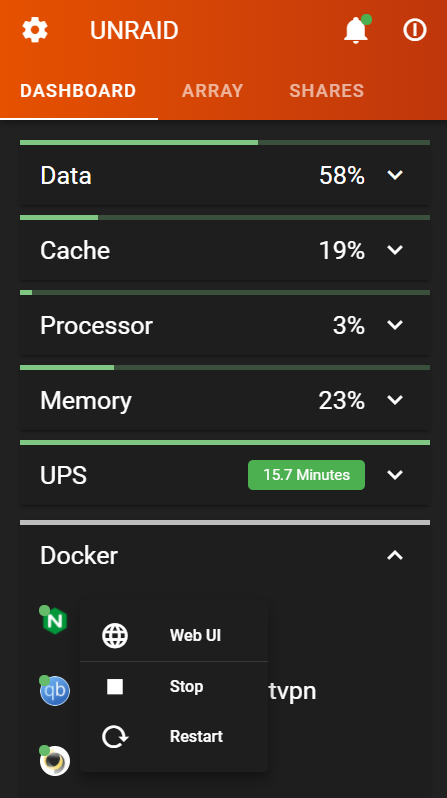
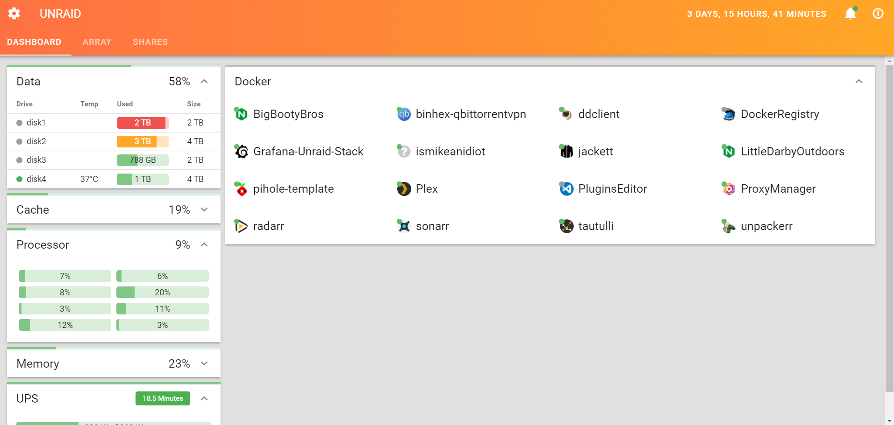

<h1>
  
  UNDASH
</h1>

Opinionated custom dashboard for Unraid

 

I've loved Unraid for years but, always felt the dashboard was cluttered.  undash is my version of the Unraid dashboard.

## WORK IN PROGRESS

[Installation Instructions](docs/INSTALL.md)
